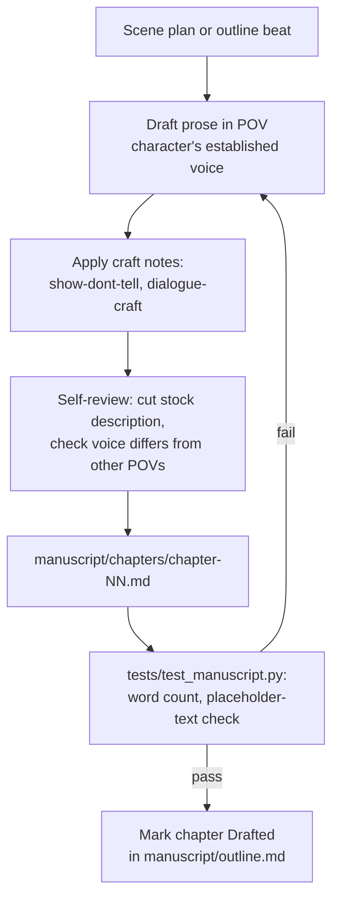

# Workflow: Chapter Drafting

Turning a scene plan into finished chapter prose.

**Inputs:** the chapter's scene plan (or outline beat, if no separate scene
plan was written), the POV character's voice notes
(`characters/NAME.md`), craft guidance in `research/`.

**Output:** `manuscript/chapters/chapter-NN.md`, target ~1,800-2,200 words
(~7-8 pages) per `research/pacing-and-chapter-length.md`.

**Checklist before marking a chapter done:**
- Matches its outline beat and doesn't reveal plot information ahead of
  `scenes/plot-map.md`'s reveal order
- POV character's voice is distinguishable from the other five (spot-check
  against `research/voice-differentiation.md`)
- No stock description reused verbatim across characters
- Has at least one scene with concrete conflict — not pure description
- Passes `tests/test_manuscript.py`
