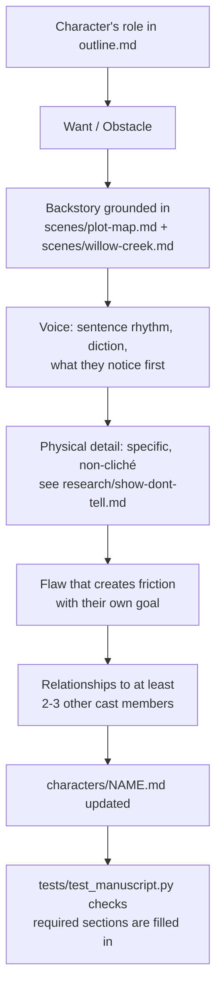

# Workflow: Character Development

Building and deepening a character profile.

**Inputs:** the character's existing entry in `characters/`, the plot facts
that touch them (`scenes/plot-map.md`), the setting (`scenes/willow-creek.md`),
craft guidance (`research/voice-differentiation.md`,
`research/show-dont-tell.md`).

**Output:** one file per character in `characters/`, each covering: Role,
Wants (internal vs. external), Obstacle, Backstory, Voice/persona, Physical
description, Flaw, Introduced, Arc, Relationships.

**When to redo this:** when a plot decision changes what a character knows
or wants, or before drafting any chapter where that character is POV — the
character file should be settled before their voice needs to show up on the
page.
