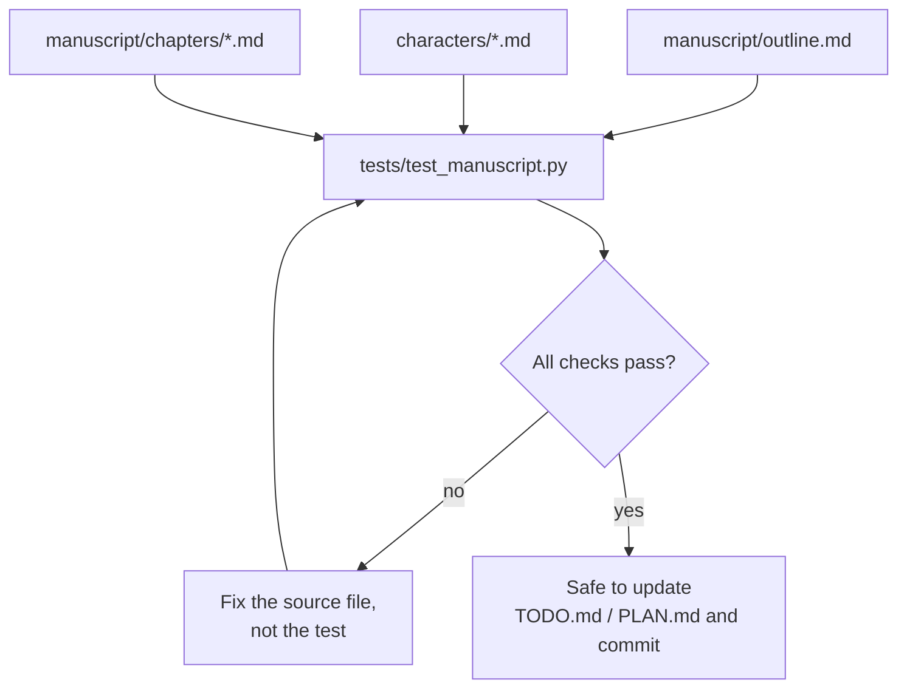

# Workflow: Continuity & Testing

Automated checks that catch structural drift before it compounds across 26
chapters — this is the "test suite" for a manuscript rather than code.



**What it checks** (see `tests/test_manuscript.py` for the authoritative
list): outline chapter count matches the current target, every character
file has its required sections filled in (no leftover
"not yet established" placeholders once a character is marked developed),
every chapter file referenced as drafted in the outline actually exists,
drafted chapters fall within the target word-count band, no stray
`TODO`/`TBD`/`XXX` markers survive in finished prose, and repo text files
are valid UTF-8 (this repo has already had one file silently corrupted to
UTF-16 — see `PLAN.md` history).

**Run it:**
```
python3 -m unittest discover -s tests
```

**Rule:** if a check fails, fix the manuscript/character/outline file — do
not weaken or delete the check to make it pass, unless the check itself was
wrong (in which case fix `tests/test_manuscript.py` and say why in the
commit message).

**When to add a new check:** whenever a real inconsistency slips through
(a continuity error, a broken cross-reference, a re-corrupted file) — add a
regression check for it rather than just fixing the instance.
