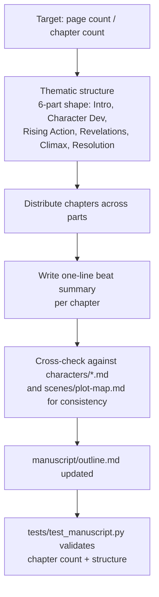

# Workflow: Outline Design

Planning or re-planning the book's chapter-by-chapter structure.

**Inputs:** target length (page/chapter count), the existing thematic
structure, character files (`characters/`), plot design
(`scenes/plot-map.md` where it exists).

**Output:** `manuscript/outline.md` — the single canonical chapter table.
This file is the source of truth for chapter count, titles, and per-chapter
beat summaries. Nothing else (character files, scene notes) should assert a
conflicting chapter count.

**When to redo this:** only when the target length/chapter count changes,
or when plot research surfaces a beat that doesn't fit the current
structure. Don't rewrite the whole outline for a single chapter's worth of
detail — that belongs in scene planning instead.
