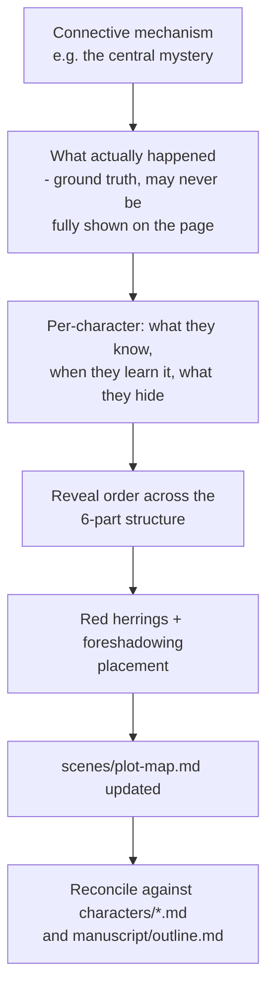

# Workflow: Plot Design

Designing the mystery/plot mechanics that underlie the outline — the layer
between "characters have goals" and "chapters have events."

**Inputs:** the connective mechanism decided in `characters/README.md`,
craft technique (`research/mystery-plotting.md`,
`research/subplot-weaving.md`), the character files.

**Output:** `scenes/plot-map.md` — ground truth for the mystery (what
happened, who knows what, when it surfaces) plus a reveal sequence mapped
against the 6-part thematic structure. This is plot logic, not
chapter-by-chapter prose planning (that's `scene-planning.md`) and not the
chapter table itself (that's `manuscript/outline.md`).

**When to redo this:** when a new open question about the central mystery
comes up during character work or drafting, resolve it here first, then
propagate the answer into the affected `characters/*.md` files and
`manuscript/outline.md` beat summaries.
