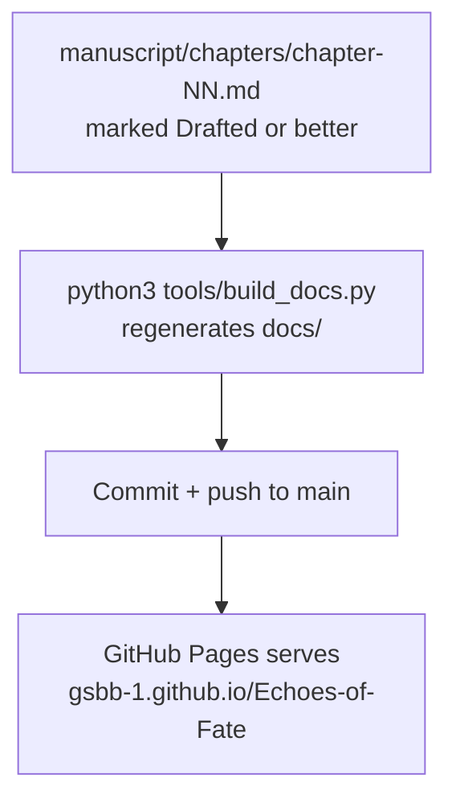

# Workflow: Publishing

Syncing finished manuscript content to the GitHub Pages site.

**Inputs:** chapters in `manuscript/chapters/` that are past the "rough
draft" stage — not every draft needs to be published immediately.

**How:** run `python3 tools/build_docs.py` from the repo root. It converts
every chapter under `manuscript/chapters/` into `docs/chNN.html` and
regenerates `docs/index.html`. The script lives in the repo so chapters
can be republished whenever they change. Push to `main`; GitHub Pages
serves from the `main` branch, `/docs` folder.

**Output:** `docs/chNN.html` (static HTML, self-contained with embedded
CSS) and an updated `docs/index.html` with a chapter list linking to each
one.

**Rule:** publish deliberately, as its own TODO item — don't republish
placeholder or mid-revision text. Once a chapter is in a state worth a
reader seeing, run the generator and commit.
