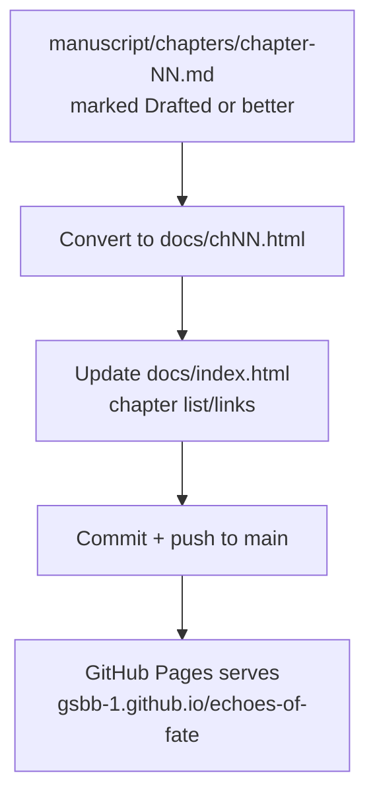

# Workflow: Publishing

Syncing finished manuscript content to the GitHub Pages site.

**Inputs:** a chapter in `manuscript/chapters/` that's past the "rough
draft" stage — not every draft needs to be published immediately.

**Output:** `docs/chNN.html` (static HTML, matching the existing
`docs/ch01.html` structure) and an updated `docs/index.html` linking to it.

**Rule:** `docs/` is hand-maintained, not auto-generated, and can lag
behind `manuscript/` — don't republish placeholder or mid-revision text.
Sync it deliberately, as its own TODO item, once a chapter is in a state
worth a reader seeing.
