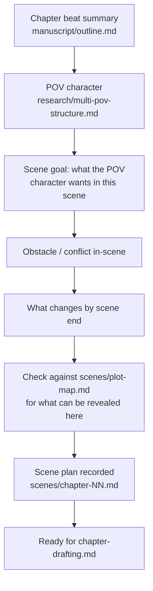

# Workflow: Scene Planning

Breaking one chapter's one-line beat summary (from `manuscript/outline.md`)
into an actual scene plan before prose gets drafted.

**Inputs:** the chapter's outline entry, the POV character's file
(`characters/`), the plot map (`scenes/plot-map.md`) for what information
can legitimately surface in this scene.

**Output:** a short scene plan — POV character, goal, obstacle, outcome —
recorded per chapter (e.g. `scenes/chapter-05.md` once chapters get scene
plans; not required for every chapter, but recommended for any chapter with
a plot-relevant reveal).

**When to skip this:** a straightforward scene that's mostly connective
tissue (no reveal, no decision point) can go straight to drafting. Reserve
written scene plans for chapters that move the plot or a relationship
forward.
